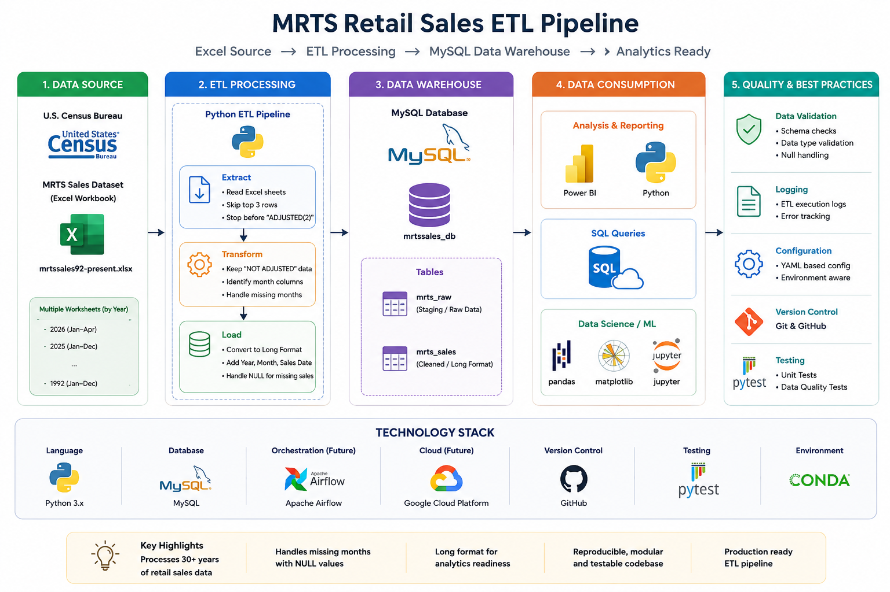

# MRTS ETL and Retail Time-Series Analytics

A production-style data engineering portfolio project that extracts the U.S. Census Bureau Monthly Retail Trade Survey (MRTS) workbook, transforms its yearly worksheets into a canonical monthly dataset, loads the result into MySQL through a staging layer, validates the load, and produces reusable trend, percentage-change, and rolling-window analyses.

## Project Architecture

<p align="center">
  
</p>

## Architecture

```text
Census Excel workbook
        │
        ▼
Python extract/transform
        │
        ▼
Canonical long-format CSV
        │
        ▼
MySQL staging table ── validation ──► curated table
        │
        ▼
SQL + pandas + matplotlib analysis
```

## Engineering features

- Dynamic worksheet and month-header detection, including partial years and headers such as `Apr. 2026(p)`.
- Exact extraction of the **NOT ADJUSTED** section without confusing it with `ADJUSTED(2)`.
- Twelve monthly records per business/year, with unavailable values preserved as SQL `NULL`.
- Centralized paths, validated YAML configuration, rotating logs, safe SQLAlchemy URLs, and CLI entry points.
- Staging-to-target loading with row-count checks, unique business keys, indexes, and repeatable full refreshes.
- Automated tests, Ruff linting, GitHub Actions CI, SQL validation queries, and reproducible analysis scripts.

## Repository layout

```text
MRTS_ETL/
├── config/database.example.yaml
├── data/{raw,processed,sample}/
├── sql/{install.sql,validation_queries.sql}
├── src/
│   ├── etl/{transform_mrts.py,load_mrts.py,test_mrts_queries.py}
│   ├── analysis/{common.py,trend_analysis.py,percentage_change.py,rolling_window.py}
│   └── utils/{config.py,database.py,logger.py,paths.py}
├── tests/
├── output/charts/
├── logs/
├── .github/workflows/ci.yml
├── Makefile
├── pyproject.toml
└── requirements.txt
```

## Data source

Download `mrtssales92-present.xlsx` from the U.S. Census Bureau retail data page and place it at:

```text
data/raw/mrtssales92-present.xlsx
```

The raw workbook is intentionally excluded from Git because source files can be large and may be updated by the publisher.

## Setup

```bash
python -m venv .venv
```

Activate it:

```bash
# Windows PowerShell
.\.venv\Scripts\Activate.ps1

# macOS/Linux
source .venv/bin/activate
```

Install dependencies:

```bash
pip install -r requirements.txt
```

Create the local configuration:

```bash
# Windows
copy config\database.example.yaml config\database.yaml

# macOS/Linux
cp config/database.example.yaml config/database.yaml
```

Edit `config/database.yaml` with local MySQL credentials. This file is ignored by Git.

## Run the pipeline

```bash
python -m src.etl.transform_mrts
python -m src.etl.load_mrts
python -m src.etl.test_mrts_queries
```

Or with Make:

```bash
make pipeline
```

## Run the analyses

```bash
python -m src.analysis.trend_analysis
python -m src.analysis.percentage_change
python -m src.analysis.rolling_window
```

Add `--show` to display figures interactively. PNG files are saved under `output/charts/`.

## Data model

The curated table stores one record per sales month, NAICS category, and business description. `sales_date` is the primary analytical time field; `year`, numeric `month`, and `month_name` are retained for convenient filtering and reporting. Sales values are nullable so partial-year source releases remain complete rather than silently dropping unavailable months.

## Validation and quality controls

- Required source markers and month headers are validated per worksheet.
- Duplicate natural keys stop the transformation or load.
- The staging table row count must equal the processed CSV row count.
- Target row count is checked after publication.
- Unit tests cover month-header variants, section-marker matching, NAICS normalization, and configuration errors.

## Tests and linting

```bash
pip install -r requirements-dev.txt
ruff check src tests
pytest -q
```

## Security and Git hygiene

Never commit `config/database.yaml`, passwords, `.venv`, raw/processed data, logs, or generated charts. The included `.gitignore` protects these paths. Review `git status` before every push.

## Key analytical questions

- What is the long-term direction of total retail and food-services spending?
- Which selected categories are growing fastest and which have the highest spending?
- How do men's and women's clothing-store sales change and contribute to their combined total?
- How do 3-, 6-, and 12-month rolling averages reveal underlying spending patterns?

## License

MIT License. See [LICENSE](LICENSE).
